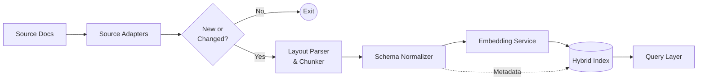
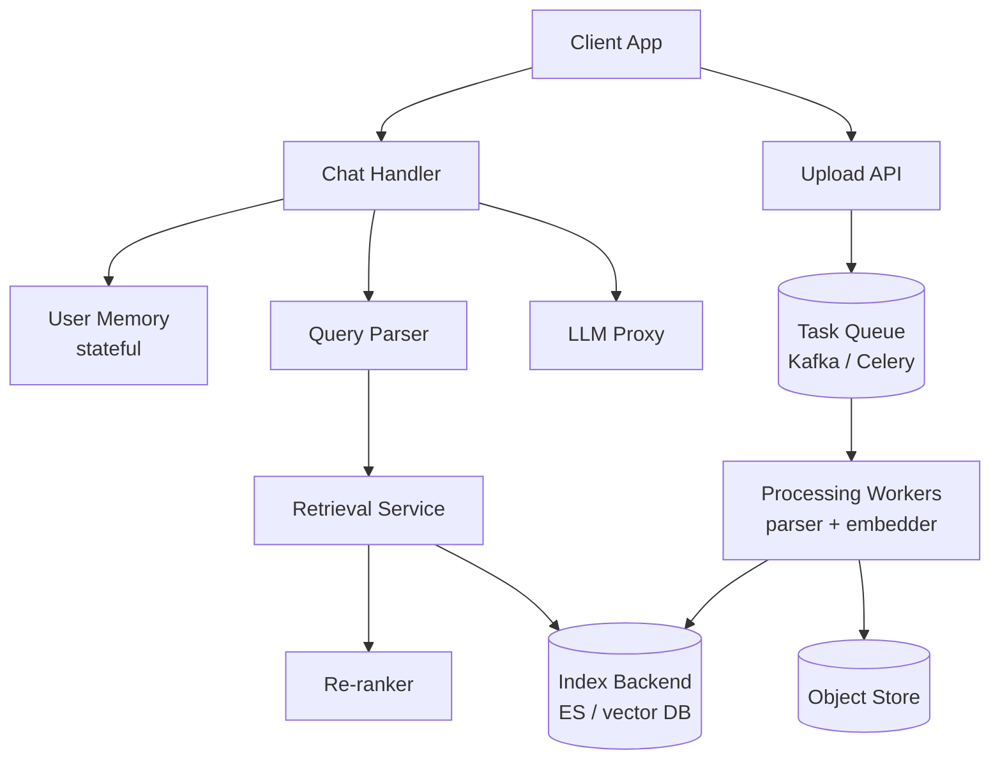

### Architectural Analysis of RagFlow

#### Deep document understanding vs naive chunking.

##### Why deep document understanding outperforms fixed-size chunking.

Deep document understanding outperforms fixed-size chunking because retrieval quality is based on the chunk quality. If the chunks are broken (eg. split in the middle of a table) retrieval algorithms can't fix that. Layout-aware parsing (like DeepDoc) ensures chunks are semantically yself-contained units before they reach the index section.

##### Retrieval Fidelity

Fixed-size chunking slices a document every N tokens. This works fine for clean prose but fails when the document has structure. If you split in the middle of a table row, the chunk you get is meaningless as a retriever can't do anything useful with half a table cell.

Layout-aware parsing understands what each region of a page is before chunking, allowing a table to stay together or a heading to stay with the section it introduces. Allows retrieval to match a question to the right content instead of a fragment.

##### Index Design

Structured chunks allow you to attach type-specific metadata at index time. For example in a table chunk it can carry column names or in a section chunk it can carry its heading. This structure allows for filtered retrieval.

##### Preprocessing Cost

Running OCR and layout classification on every page is slow and expensive in comparison to just splitting on whitespace. The trade-off is clear. Higher ingestion cost in exchange for higher retrieval quality. For enterprise RAG where documents are complicated financial reports, contracts, slide decks, the cost of layout-aware parsing can be amortized over many queries. Thus, native chunking should only be used for clean-uniform documents where structural signals add no information.

#### Chunking strategy: template vs semantic.

##### Template-based Chunking

Template-based chunking uses structural rules such as splitting on headings, table boundaries, paragraph breaks etc. It doesn't go through the content it just pattern matches the structure.

##### Embedding-driven Semantic Segmentation

Semantic hcunking embeds windows of text and finds split points where the embedding similarity drops. This allows them to indicate and detect topic shifts.

##### Failure analysis
For highly structured documents semantic chunking fails. For example a Q3 earnings table followed immediately by a Q4 earnings table has a very high inter-table embedding similarity. Thus the semenatic segmenter would see no strong topic boundary and may merge the two tables into one chunk. The retriever would then return a chunk containing both quarters which introduces noise. Template-bound chunking splits at table boundaries by rule which would be ideal. 

For loosely structured corpora, template-based chunking fails. Chat logs have little structural markers. Template-based chunking may cut mid topic or merge unrelated topics. Semantic chunking performs better as it detects when the conversation shifts even without structural help.

##### Synthesis

Thus the optimal strategy is to use both. First use template rules to capture high-confidence structural boundaries then apply semantic segmentation within each template region to detect finer-grained topic shifts. RAGFlow's configurable chunking supports this.

#### Hybrid retrieval architecture.

##### Why hybrid retrieval improves recall and precision.

BM25 and dense retrieval are complementary failure modes. Thus, combining them would help. This hybrid search would take the top candidates from both, puts the scores together then re-ranks them using a cross-encoder. The cross-encoder can catch signals that a bi-encoder misses as it reads the query and the document together to compare them as independent embeddings. The union of both retrieval signal improves recall. 

##### Concrete Failure Cases

Lexical-only failure query: "How do I reduce model hallucination?". The corpus contains a document about minimizing LLM confabulation. BM25 scores this near zero and fails to retrieve it. Lexical retrieval can't bridge synonym gaps or paraphrase variation. 

Vector-only failure query: "Find the GDPR Article 17 text". A dense retriever maps the query to a semantic neighborhood of data deletion rights documents, but it doesn't rank the exact article text first. If paragraphed article 17 summaries exist that have a higher embedding similarity it could rank it above. It also struggles any identifier where the exact string matters.

Hybrid failure. When BM25 and vector scores are both high for a wrong document. For example, a document that shares key terms and is semantically adjacent which satisfies both BM25 and dense retrieval but isn't actually relevant it amplifies the false positive rather than cancelling it. This can occur in template documents like legal disclaimers that share vocabulary with many queries. Re-ranking helps this but doesn't eliminate it if the re-ranker hasn't seen the domain.

#### Multi-stage retrieval pipeline

##### Why multistage pipeline is superior to a single-pass ann.

A single ANN pass is fast (O(log(n))), however it only uses one signal which is how close the query embedding is to each document embedding. Thats a broad approximation as the model that generates embeddings does the ecncoding of the query and document seperately which misses parts of their relationship.

A multi-stage pipeline splits this into two jobs. Stage 1 is candidate generation and is optimized for recall. It finds a large set of plausible candidates quickly using ANN + BM25. Stage 2 is reranking and is optimized for precision. Takes the smaller set and score each candidate properly with a cross-encoder. 

##### Recall vs Latency Trade-Off

Increasing candidate set in stage 1 improves recall as more of the relevant documents survive into stage 2 but increases re-ranking latency linearly. A real-time chat assistant may use k=20 with a fast bi-encoder re-ranker but a research assistant may use k=200 with a full cross-encoder. This is tunable per use case.

##### Cascading Error Propogation
If stage 1 misses a relevant document no downstream stage can recover it as re-ranking can only reorder what it recieves. The recall ceiling problem is that the pipeline's maximum recall is bounded by stage 1's recall. Error from stage 1 propogates forwards and compounds with hallucination risk in the LLM general stage because the model recieves no grounding context.

#### Indexing strategy and storage backends.

The choice of storage backend is determined by dominant query workload, required retrieval modalities, and consistancy/latency requirements.

##### Elasticsearch-like hybrid store

Elasticsearch handles keyword search, metadata filtering, and vector search. It's operationally mature. Good for queries like "find documents tagged x that mention y". Good for most enterprise RAG use cases but not the fastest at pure vector search at a large scale.

##### Vector-native DB

A vector-native database is used when the workload is dominated by semantic similarity search and the scale is large enough that elasticsearch can't perform without a bottleneck. The tradeoff is weaker support for structured filtering and more operational complexity.

##### Graph-augmented store.

The right choice when the knowledge has explicit relational structure, when the queries require multi-hop traversal, or when explainability is a hard-requirement. However, graph construction requires entity extraction and relation detection at ingestion which is expensive and error-prone.

#### Query understanding and reformulation.

##### Why query transformation is critical in RAG.

Raw user queries are often short, ambiguous, and underspecified for the retrieval task. Thus they are a poor specification of the information need and not explicit. 

##### Static query to retrieval

Passes the raw query directly to retrieval stage. Efficient but brittle. Fails when the user uses terminology different from indexed vocab, when the query is a follow-up in a multi-turn conversation with missing coreference, or when the query is complex and requires answers from multiple documents. 

##### Iterative query refinement

Uses LLM to expand the query with synonyms or hypothetical document embeddings, decompose complex queries into subqueries that can be answered independently and merged, and refine based on retrieved context. Iterative refinement is slow but gives complete answers which means its unsuitable for latency-sensitive applications but essential for deep research tasks.

#### Knowledge representation layer.

##### Dense vector space.

Documents and queries are embedded into a continuous high-dimensional space where semantic proximity maps to geometric proximity. Retrieval is approximate nearest neighbor search. Limited compositional reasoning as dense embeddings compress meaning into a single point. Thus can't represent the logical structure to let system answer multi-hop questions. Essentially no retrieval explainability, why a vector was retrieved can't be articulated.

##### Relational schema.
Documents are decomposed into structured records stored in relational tables with types columns and foreign keys, retrieval with SQL queries. Strong compositional reasoning as SQL JOIN operations implement multi-hop traversal explicitly and correctly. Doesn't work for unstructured text as can't be normalized into relational schema without information loss. High retrieval explainability as SQL queries are interpretable and the reasoning path is exposed. 

##### Knowledge graph
Entities and relationships are first-class objects. Nodes represent concepts, edges represent typed relations. Supports multi-hop traversal. Strongest compsitional reasoning. A knowledge graph explicity represents path which enables a graph traversal to answer the multi-hop questions. High retrieval explainability as each retrieval can be traced through path of graph edges traversed. 

#### Data ingestion pipeline architecture.

##### Schema normalization across sources.
Each source type produces raw data in different formats. The cleanest approach is source-specific adapters that produce the same schema for document representation. The PDF adaptor runs layout parsing, HTML adaptor strips navigation and extracts body text, database adaptor serializes records into chunks. This allows everything downstream to see the same format regardless of origin and don't need to know where a document came from.

##### Incremental indexing.

Keeping the index fresh without reprocessing everything means you need to track what has changed. A content hash can be used to skip re-processing. For changed documents, chunk-level versioning means you only re-embed and re-index the chunks that have changed rather than the whole document. Deleted documents need to be tombstoned in the index before the index fully cleans them up.

##### Consistency vs throughput trade-offs
High throughput ingestion batches embedding calls, which improves GPU utilization. However there will be a lag between document upload and query availability (consistency window). If a document is needed to be searchable immediately after upload you need a synchronous path that bypasses batching (costs throughput). RAGFlow's pipeline uses async task queue for batch ingestion and a seperate real-time path for small documents. 

#### Memory design in RAG systems.

##### Vector memory

Past interactions are embedded and stored in a vector store. Each new query the memory store is searched for semantically similar past context which allows the system to recall relevant prior discussions without explicit key-value lookup. A strength is that approximate recall is often good enough. Scales to millions of past interations. 

##### Structured memory

Facts extracted from interations are stored as structured records. Strengths are that it supports precise structured queries and has high explainability. Weakness is that it requires entity extraction and slot-filling at memory write time which could be error prone. Schema must be designed in advance and recall for complex unstructured memories is poor.

##### Episodic logs

Raw interaction logs are stored with timestamps and session IDs. Retrieval is by time window/session/entity mension. Simplest architecture. Strengths are that nothing is lost or summarized and its auditable. Weaknesses are that raw logs grow unboundedly and retrieval requires full-text search or a seperate indexing layer. No semantic recall.

For production a layered memory architecture combining all three is best.

#### End-to-end system decomposition

##### Microservices architecture for Ragflow.

##### Stateless vs stateful services.

Stateless services hold no session state between requests. All request context is passed in the request payload. Horizontally scalable with zero coordination, adding replicas increases throughput linearly. Covers Chat Handler, LLM Proxy, Retrieval Service, Re-ranker, Query Parser, and Workers (parser and embedder)

Stateful services hold durable state that must survive restarts. Require replication and consistent storage. Memory service is stateful as it maintains per-user memory that must be consistent across requests. Memory Service, Index Backend, Object Store.

##### Scaling strategy per component.

Chat Handler: horizontal, CPU-bound, scale on RPS
Query Parser/Retrieval Service: horizontal, I/o-bound, scale on QPS
Re-ranker/Processing Workers: horizontal, GPU-bound, scale on GPU count
Processing Workers: horizontal, CPU-bound, scale on ingestion queue depth
Index Backend: vertical + shard-based horizontal
Memory Service: vertical + read replicas for read-heavy workloads

##### Failure isolation boundaries.

The ingestion pipeline and query-service pipeline must be fully decoupled so a burst of document uploads doesn't degrade chat latency. Task queue acts as isolation boundary, chat path never waits on ingestion. 

Within chat path, LLMProxy and RerankService are highest latency components and most likely to become bottlenecks thus must have circuit breakers. If re-ranker fails retrieval service returns BM25+vector fusion top-k without re-ranking. If LLM proxy unavailable, Chat Service return 503.

Index Backend is the only single point of failure for retrieval quality. Must be deployed as replicated cluster with automatic failover. All other services can tolerate restarts without dataloss (stateless).
